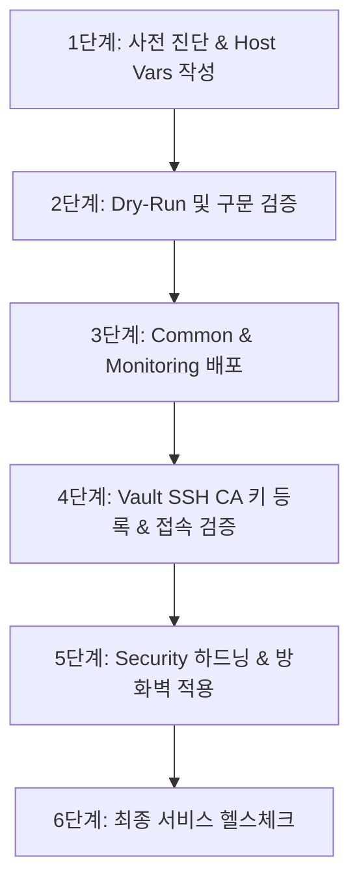

# 온프레미스 프로비저닝 및 기존 머신 마이그레이션 가이드라인

본 문서는 소-중규모 IDC 온프레미스 인프라 환경에서 **신규 서버 베이스라인 프로비저닝** 및 **기존 레거시 서버 마이그레이션(표준화)**을 안전하게 수행하기 위한 Role별(`common`, `security`, `monitoring`) 상세 가이드라인과 체크리스트를 정의합니다.

---

## 1. 개요 및 워크플로우 비교

| 구분 | 신규 서버 프로비저닝 (Greenfield) | 기존 머신 마이그레이션 (Brownfield) |
|---|---|---|
| **목적** | OS 설치 직후 베이스라인 표준 형상 즉시 주입 | 운영 중인 서비스 중단 없이 Overseer 표준 형상으로 점진적 수렴 |
| **위험도** | 낮음 (초기 설정 실패 시 재설치 가능) | **높음** (SSH 접속 차단, 방화벽 포트 누락, 서비스 충돌 주의) |
| **적용 전략** | 일괄 프로비저닝 (`provision.yml`) | **3단계 마이그레이션 (사전 점검 -> 단계별 배포 -> 사후 검증)** |

---

## 2. Role별 상세 가이드라인

### 1) Common (시스템 베이스라인, NTP, 계정, 커널 튜닝)

#### [핵심 목표]
- 시간 동기화(Chrony), 로케일/타임존(`Asia/Seoul`), 기본 유틸리티 표준화
- 커널 파라미터(`sysctl`) 튜닝 및 관리자(`infra-admin`) 계정/무비밀번호 sudo 표준화

#### [신규 프로비저닝 가이드]
- `provision.yml` 실행 시 `common` 역할이 가장 먼저 적용되어 시스템 기본 환경을 구성합니다.
- 패키지 업데이트(`apt update` / `dnf makecache`)가 자동으로 수행됩니다.

#### [기존 머신 마이그레이션 주의사항 & 체크리스트]
- [ ] **NTP 충돌 점검**: 기존에 `ntpd`, `systemd-timesyncd`, `openntpd` 등이 활성화되어 있다면 데몬 충돌이 발생할 수 있습니다.
  - 마이그레이션 전: `systemctl is-active ntpd systemd-timesyncd` 확인
  - Chrony 전환 시 기존 ntp 데몬 정지/비활성화 처리
- [ ] **커널 파라미터(`sysctl`) 사전 검증**:
  - 기존 애플리케이션(예: Elasticsearch의 `vm.max_map_count`, Oracle/MySQL의 공유 메모리 파라미터)이 특정 sysctl 설정을 요구하는지 확인하고, `group_vars/` 또는 `host_vars/`에 병합하여 덮어쓰기 방지
- [ ] **기존 사용자 계정 및 Sudoers 보존**:
  - `ansible.builtin.user` 모듈에서 `append: yes`를 사용하여 기존 보조 그룹 소속이 유실되지 않도록 보장
  - `/etc/sudoers` 원본 파일을 직접 수정하지 않고 `/etc/sudoers.d/90-infra-admin` 형태로 분리 관리

---

### 2) Security (SSH 하드닝, 방화벽, Vault SSH CA)

#### [핵심 목표]
- 루트 로그인 차단(`PermitRootLogin no`), 비밀번호 인증 비활성화(`PasswordAuthentication no`)
- HCP Vault SSH CA 연동을 통한 단기 서명 인증서 기반 SSH 접근 활성화
- UFW / Firewalld 호스트 방화벽 활성화 및 인바운드 최소화

#### [신규 프로비저닝 가이드]
- Vault SSH CA 키(`trusted-user-ca-keys.pem`) 배포 후 즉시 SSH 보안 하드닝 및 방화벽을 적용합니다.

#### [기존 머신 마이그레이션 주의사항 & 체크리스트 (★ 최고 위험 구간)]
- [ ] **SSH 락아웃(Lockout) 방지 절차**:
  - **절대 주의**: Vault SSH CA 연동 및 `infra-admin` SSH 키 접속 테스트가 완료되기 전에 `PasswordAuthentication no`를 먼저 적용하지 마십시오.
  - 마이그레이션 1단계: Vault CA 등록 및 관리자 공개키 배포 -> 별도 세션에서 Vault 서명 키로 로그인 성공 확인 -> 2단계: 비밀번호 로그인 차단
- [ ] **운영 포트 누락으로 인한 서비스 차단 방지 (방화벽)**:
  - 기존 서버에서 LISTEN 중인 모든 포트를 사전 수집:
    ```bash
    ss -tulpn | grep LISTEN
    ```
  - 해당 포트(웹, DB, 내부 RPC, 백업, 에이전트 등)를 대상 호스트의 `host_vars/<hostname>.yml` 내 `firewall_allowed_tcp_ports`에 반드시 사전 정의 후 방화벽 활성화
- [ ] **SSH 데몬 재시작 안전성**:
  - `sshd -t` 설정을 사전 검증하고, Ansible 작업 세션이 끊기지 않도록 `ssh_args` 연결 유지 옵션을 유지

---

### 3) Monitoring (OpenTelemetry Collector Contrib with Hostmetrics)

#### [핵심 목표]
- `otelcol-contrib`의 `hostmetrics` receiver를 통한 호스트 OS/커널 메트릭(CPU, Memory, Disk, Net 등) 직접 수집
- `filelog` receiver를 통한 시스템 보안/감사 로그 수집 및 중앙 OpenObserve로 OTLP 아웃바운드 푸시 (호스트 인바운드 포트 불필요)
- 기존 노드에 잔존하는 레거시 `node_exporter` 자동 정리(Stop/Disable/Remove)

#### [신규 프로비저닝 가이드]
- 표준 버전 바이너리를 다운로드하여 시스템 유저(`otelcol-contrib`) 권한으로 단일 데몬을 실행합니다.

#### [기존 머신 마이그레이션 주의사항 & 체크리스트]
- [ ] **레거시 Node Exporter 정리**:
  - `cleanup_legacy_node_exporter: true`(기본값)를 통해 기존 9100 포트 점유 프로세스 및 잔재를 안전하게 정리합니다.
- [ ] **기존 모니터링 에이전트 마이그레이션**:
  - 이전 수집 에이전트(Zabbix, Telegraf, Datadog 등)가 병행 실행되어야 하는지, 아니면 완전 대체 대상인지 사전에 협의 후 프로세스 정리
- [ ] **OTLP 아웃바운드 통신 확인**:
  - 타겟 노드에서 중앙 OpenObserve 엔드포인트로의 아웃바운드(Outbound) HTTP/gRPC 통신이 허용되어 있는지 확인 (인바운드 포트 오픈 불필요)


---

## 3. 기존 머신 마이그레이션 단계별 실행 절차 (Step-by-Step)



### 1단계: 사전 진단 및 host_vars 작성
대상 레거시 머신의 OS, 열린 포트, 기존 계정, 디스크 마운트를 조사하고 `inventory/host_vars/<hostname>.yml`을 구성합니다.
```yaml
# 예시: inventory/host_vars/legacy-web-01.idc.internal.yml
ansible_host: 192.168.10.50
firewall_allowed_tcp_ports:
  - 22    # SSH
  - 80    # Nginx HTTP
  - 443   # Nginx HTTPS
  - 8080  # 사내 백엔드 앱
```

### 2단계: Dry-Run (Check Mode) 실행
실제 변경을 가하기 전에 변경될 항목을 시뮬레이션합니다.
```bash
ansible-playbook -i inventory/hosts.yml playbooks/provision.yml \
  --limit legacy-web-01.idc.internal \
  --check --diff
```

### 3단계: 안전한 점진적 롤 배포 (태그 기반)
```bash
# 1. 시스템 기본 패키지 및 NTP/튜닝 적용
ansible-playbook -i inventory/hosts.yml playbooks/provision.yml \
  --limit legacy-web-01.idc.internal --tags "common"

# 2. 모니터링 에이전트 배포 및 메트릭 수집 확인
ansible-playbook -i inventory/hosts.yml playbooks/provision.yml \
  --limit legacy-web-01.idc.internal --tags "monitoring"

# 3. Vault SSH CA 키 배포 (비밀번호 차단 전)
ansible-playbook -i inventory/hosts.yml playbooks/provision.yml \
  --limit legacy-web-01.idc.internal --tags "vault"

# 4. Vault 서명 키로 로그인 정상 동작 확인 후, 보안 하드닝 및 방화벽 적용
ansible-playbook -i inventory/hosts.yml playbooks/provision.yml \
  --limit legacy-web-01.idc.internal --tags "security,boundary"
```

### 4단계: 사후 검증
1. Vault SSH Certificate 및 Boundary 세션으로 정상 접속 가능한지 확인
2. 호스트 방화벽 활성화 후 서비스 트래픽(HTTP/DB/내부 포트) 정상 통신 여부 확인
3. Prometheus 대시보드(Grafana)에서 노드 메트릭 수집 확인

---

## 4. OS 버전별 지원 매트릭스 및 호환성 가이드

CentOS 6(레거시)부터 CentOS 7, 8, Rocky Linux 9, 10(최신)까지의 환경별 지원 및 제약 사항 매트릭스입니다.

| 항목 | CentOS 6 (레거시) | CentOS 7 (EOL) | CentOS 8 / Stream | Rocky Linux 9 / 10 |
|---|---|---|---|---|
| **기본 패키지 관리** | `yum` (vault.centos.org 전환 필요) | `yum` (vault.centos.org 전환 필요) | `dnf` | `dnf` |
| **시간 동기화** | `ntp` / `ntpd` | `chrony` | `chrony` | `chrony` |
| **방화벽 도구** | `iptables` | `firewalld` (또는 `iptables`) | `firewalld` | `firewalld` (nftables 백엔드) |
| **Init 시스템** | SysV init (`service`, `chkconfig`) | `systemd` | `systemd` | `systemd` |
| **기본 Python 버젼** | Python 2.6 (Ansible 연결시 raw/python27 고려) | Python 2.7 (EPEL python36 권장) | Python 3.6+ | Python 3.9 ~ 3.12 |
| **HCP Vault SSH CA** | ⚠️ **직접 지원 불가** (OpenSSH 5.3으로 `TrustedUserCAKeys` 미지원) | ✅ **완벽 지원** (OpenSSH 7.4) | ✅ **완벽 지원** (OpenSSH 8.0) | ✅ **완벽 지원** (OpenSSH 8.7+) |
| **HashiCorp Boundary** | ✅ SSH Target 접속 지원 | ✅ SSH Target 접속 지원 | ✅ SSH Target 접속 지원 | ✅ SSH Target 접속 지원 |
| **Node Exporter** | ✅ 바이너리 수동/SysV 실행 가능 | ✅ Systemd 서비스 등록 | ✅ Systemd 서비스 등록 | ✅ Systemd 서비스 등록 |

### OS 버전별 특별 대응 지침:
1. **CentOS 6 레거시 서버**:
   - OpenSSH 5.3은 SSH Certificate Authority(`TrustedUserCAKeys`)를 지원하지 않으므로, Vault SSH CA 자동 주입 태스크가 자동 스킵됩니다.
   - 대체 방안: `infra-admin`의 정적 SSH Public Key를 배포하거나, OpenSSH를 상위 버전으로 별도 빌드/업그레이드해야 합니다.
   - YUM 레포지토리가 닫혀있으므로 플레이북의 `Fix EOL CentOS 6 / 7 Vault Repositories` 태스크를 통해 `vault.centos.org` 아카이브로 자동 전환됩니다.
2. **CentOS 7 서버**:
   - OpenSSH 7.4가 기본 탑재되어 있어 Vault SSH CA를 정상 지원합니다.
   - 공식 미러가 종료되었으므로 `vault.centos.org` 주소로 패키지를 설치합니다.
3. **Rocky Linux 9 / 10 최신 서버**:
   - `dnf` 패키지 관리자 및 최신 `crypto-policies` 정책이 적용됩니다.
   - Vault SSH CA 및 Boundary Target과 완벽 호환됩니다.

