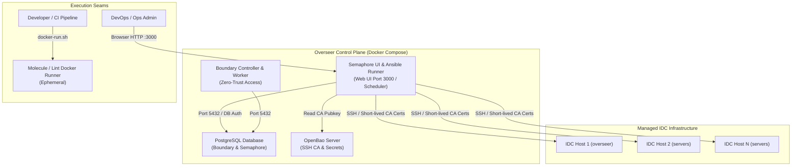

# 3. Semaphore UI Integration and Unified Ansible Orchestration Architecture

- **Status**: Accepted
- **Date**: 2026-08-28
- **Deciders**: Overseer Engineering Team & User
- **Context**: Central Control Plane & Ansible Automation Layer Integration

---

## 1. Context & Problem Statement

Overseer의 초기 아키텍처에서는 컨트롤 플레인 컨테이너 스택(OpenBao, Boundary, Postgres)과 온프레미스 노드 프로비저닝(Ansible)이 분리되어 개발자/운영자가 터미널 CLI(`docker-run.sh`)를 통해서만 프로비저닝을 수행해야 했습니다.

이로 인해 다음과 같은 운영상 요구사항과 과제가 발생했습니다:
1. **웹 기반 프로비저닝 인터페이스 부재**: 비개발자/운영팀이 신규 서버 프로비저닝 및 정기 점검 작업을 수행할 때 CLI 접근 권한 및 SSH 키를 공유해야 하는 보안/운영 리스크.
2. **컨트롤 플레인과 실행 런타임의 중복**: `compose.yml` 내에 웹 UI용 서비스와 CLI용 독립 Ansible 컨테이너가 중복 정의되어 리소스 낭비 및 관리 포인트 증가.
3. **개발/CI 테스트 환경과의 격리**: Molecule 컨테이너 테스트 및 ansible-lint와 같은 개발/검증 툴체인은 Docker 소켓 마운트가 필요한 특수 환경이므로 상시 운영 웹 서비스와 적절히 분리되어야 함.

---

## 2. Decision Outcomes (결정 사항)

### 2.1 Semaphore UI 단일 컨테이너 운영 아키텍처 (Option A)
- **컨트롤 플레인 상시 서비스 일원화**:
  - `compose.yml`에서 상시 기동용 `ansible` 서비스를 제거하고 **`semaphore` 단일 서비스**로 통합 운영.
  - Semaphore 컨테이너는 내장된 Ansible 런타임, 웹 UI(Port 3000), 스케줄러, PostgreSQL 백엔드를 통해 모든 플레이북 실행 및 상태 관리를 전담.
  - Ansible 디렉토리(`/ansible`), OpenBao CA 공개키(`/openbao/data`), 관리자 SSH 키(`~/.ssh`)를 Semaphore에 볼륨 마운트하여 기존 플레이북 및 인벤토리 100% 호환성 유지.

### 2.2 개발 및 CI 테스트 툴체인 역할 분리
- **`ansible/docker-run.sh` 및 `ansible/Dockerfile`**:
  - `compose.yml`의 상시 서비스에서는 제외하되, **로컬 개발자 CLI 및 CI 파이프라인의 일회성(Ephemeral) 테스트 실행기**로 유지.
  - Molecule 컨테이너 통합 테스트(`make test-molecule`) 및 린트(`make lint`)는 `docker-run.sh`를 통해 독립 컨테이너 환경에서 안전하게 실행.

### 2.3 리소스 격리 및 안정성 보장
- Semaphore 컨테이너에 CPU 1.5 Core / RAM 1024MB (Limit)을 할당하여 웹 인터페이스 서빙 및 백그라운드 Ansible Fork 프로세스의 안정적인 런타임 보장.

---

## 3. Architecture Diagram

---

## 4. Consequences & Trade-offs

- **장점 (Pros)**:
  - **단일 제어 지점**: 웹 UI 클릭 한 번으로 신규 서버 프로비저닝, 롤백, 정기 점검 가능.
  - **자원 최적화**: Docker Compose 스택의 불필요한 중복 컨테이너 제거로 유휴 자원 절약.
  - **관심사 분리**: 상시 운영 서비스(Semaphore)와 개발/테스트 전용 도구(Molecule/docker-run.sh)의 명확한 역할 분리.
- **고려사항 (Mitigations)**:
  - Semaphore 컨테이너 장애 시에도 비상 시 `ansible/docker-run.sh` CLI를 통해 즉시 독립 프로비저닝 가능(Break-glass).
